# This report describes some results from an analysis finalized on 6 June 2017

For all figures below, the crosshair indicates the theoretical position of the dip9ole in the phantom.

The CT scan that is shown in the background is not 100% correctly coregistered with the actual phantom (this is a known bug in the analysis script).

Ideally, the color-coded distribution of the inverse solution should have its peak at the crosshair.

## 1000 nAm dipole

### Residual variance scan, -log10()
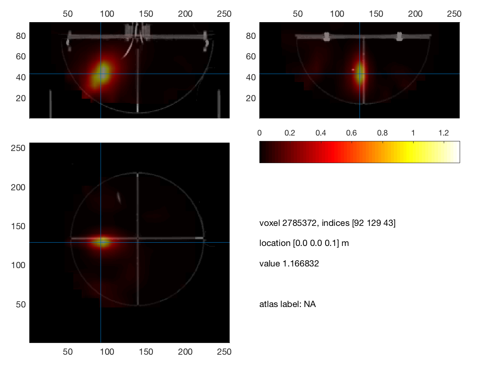
### LCMV scan, log10(active/baseline)

### Residual variance scan, -log10()

### LCMV scan, log10(active/baseline)

### Residual variance scan, -log10()

### LCMV scan, log10(active/baseline)
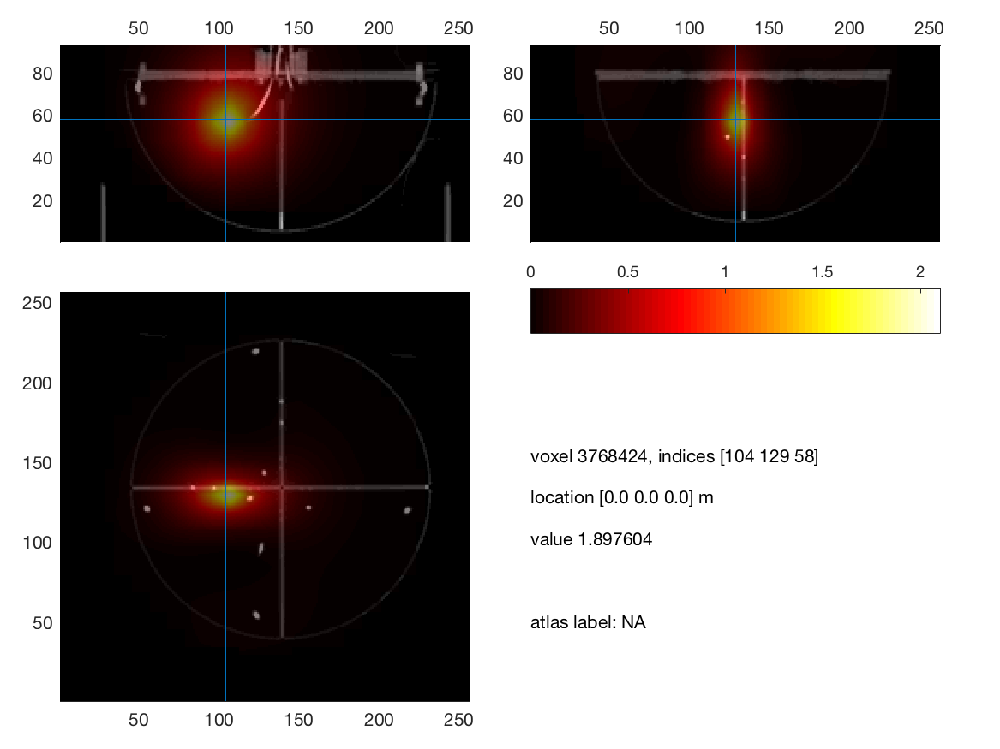

### Residual variance scan, -log10()

### LCMV scan, log10(active/baseline)
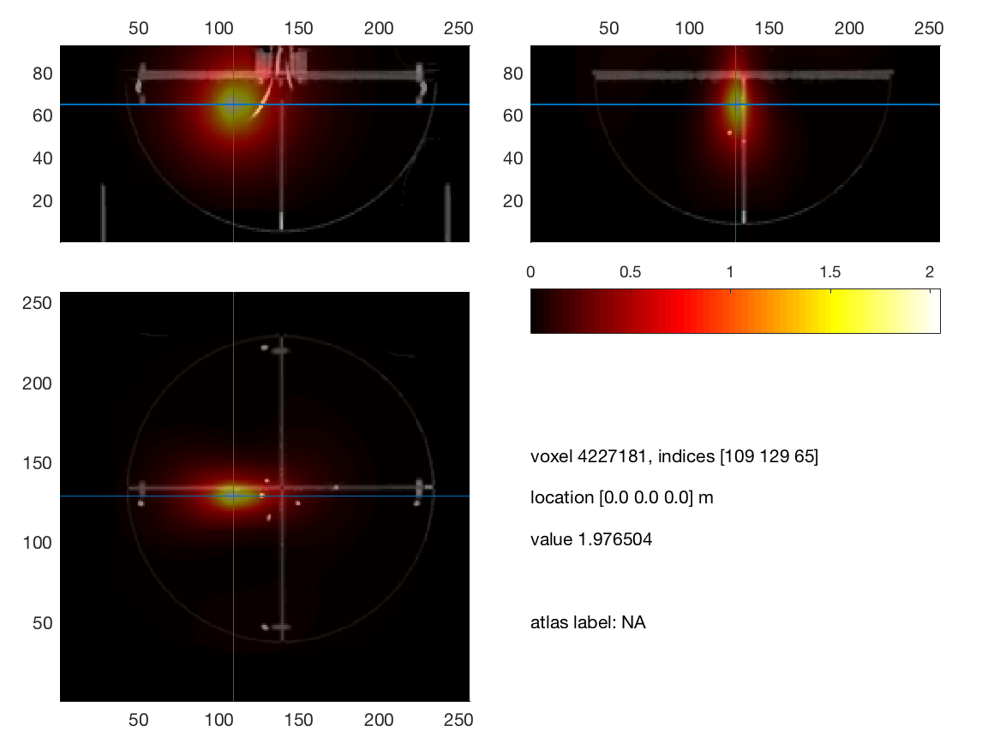

## 200 nAm dipole

### Residual variance scan, -log10()

### LCMV scan, log10(active/baseline)
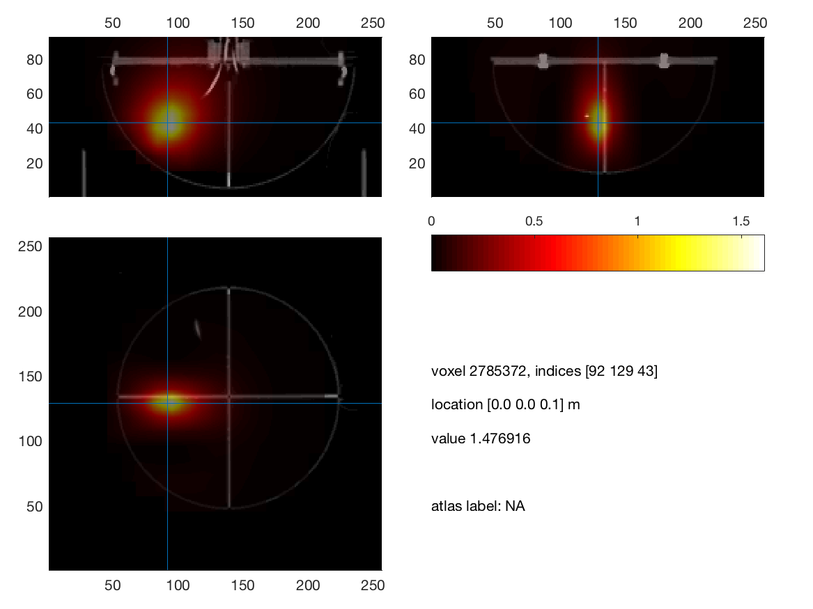

### Residual variance scan, -log10()

### LCMV scan, log10(active/baseline)
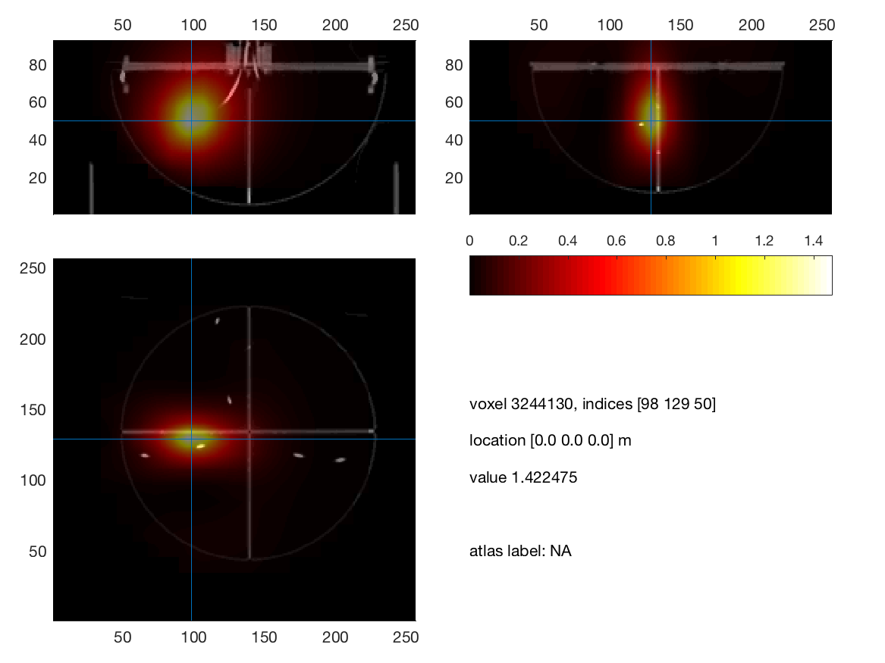

### Residual variance scan, -log10()
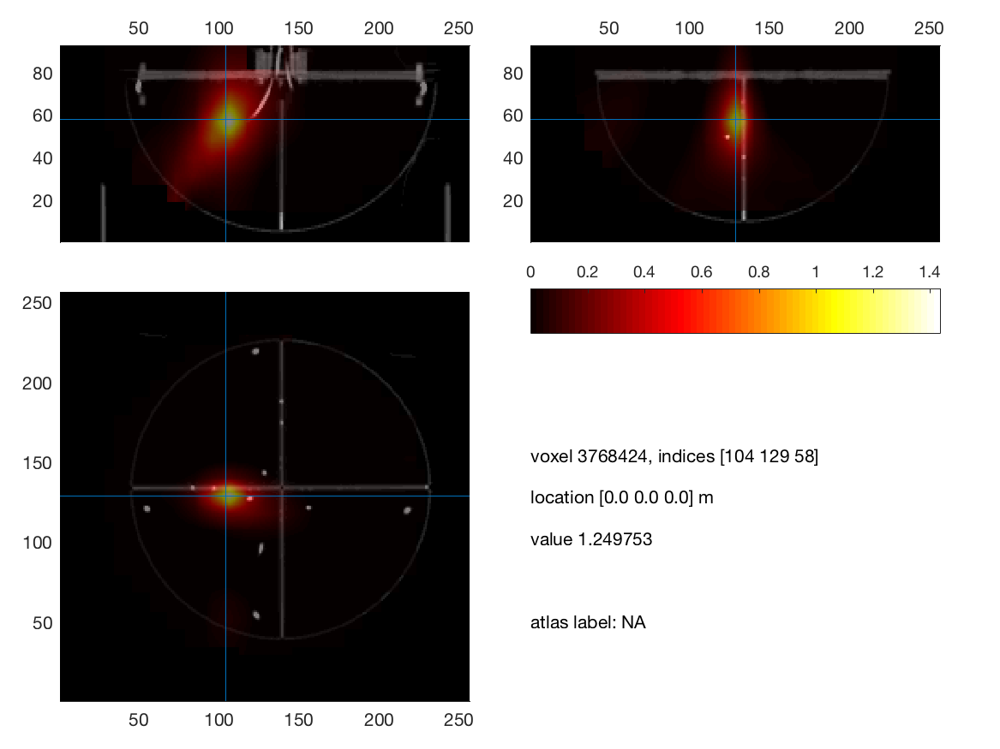
### LCMV scan, log10(active/baseline)

### Residual variance scan, -log10()

### LCMV scan, log10(active/baseline)
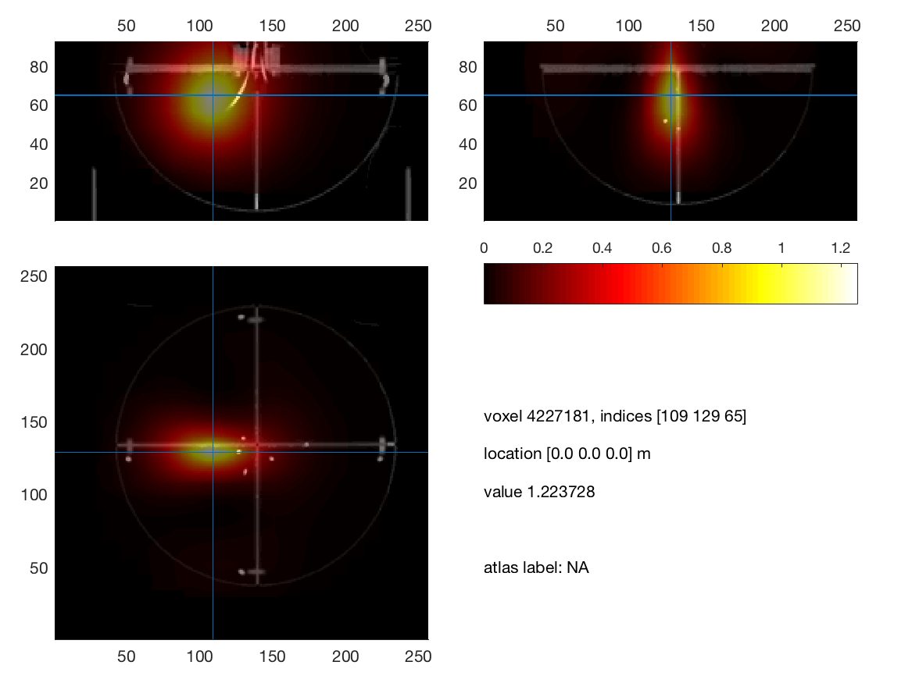

## 100 nAm dipole

### Residual variance scan, -log10()

### LCMV scan, log10(active/baseline)

### Residual variance scan, -log10()
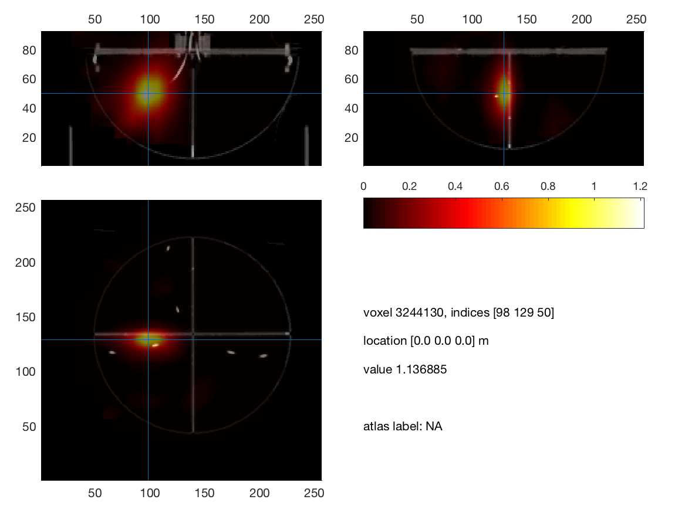
### LCMV scan, log10(active/baseline)

### Residual variance scan, -log10()

### LCMV scan, log10(active/baseline)

### Residual variance scan, -log10()

### LCMV scan, log10(active/baseline)

## 20 nAm dipole

### Residual variance scan, -log10()

### LCMV scan, log10(active/baseline)

### Residual variance scan, -log10()
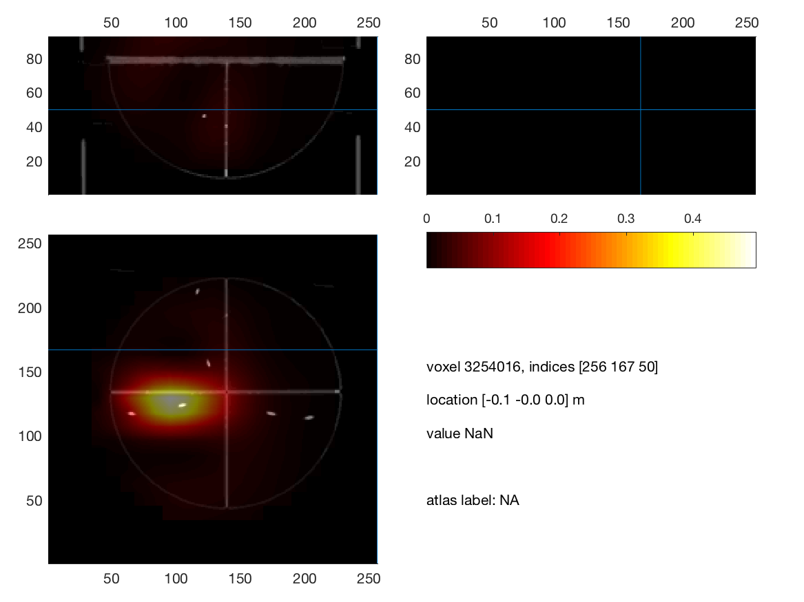
### LCMV scan, log10(active/baseline)
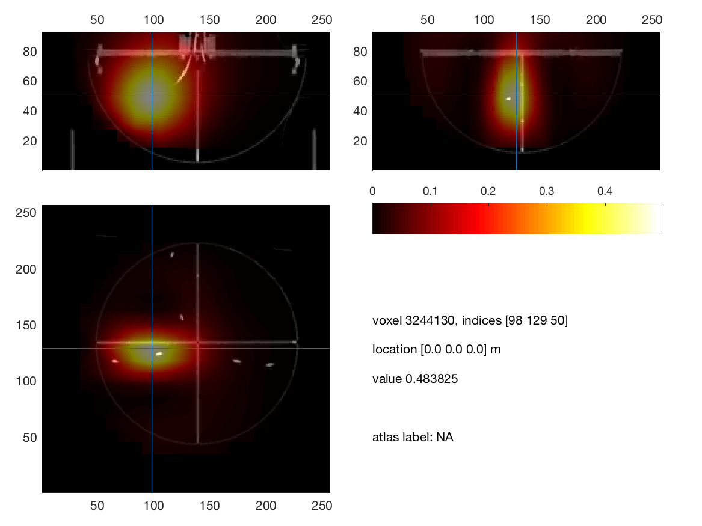

### Residual variance scan, -log10()
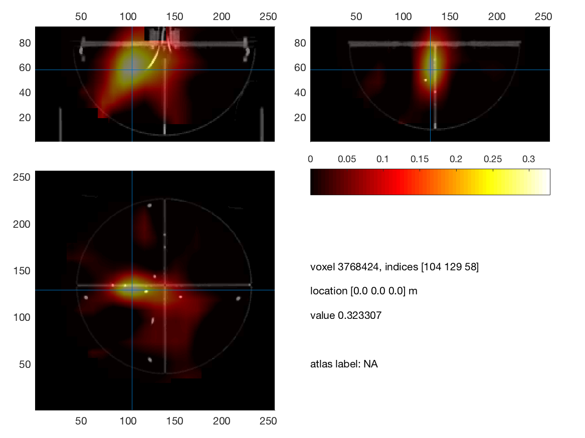
### LCMV scan, log10(active/baseline)
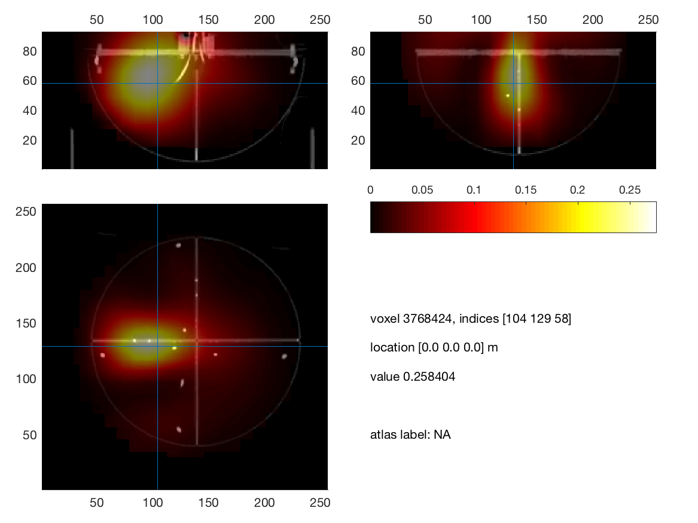

### Residual variance scan, -log10()
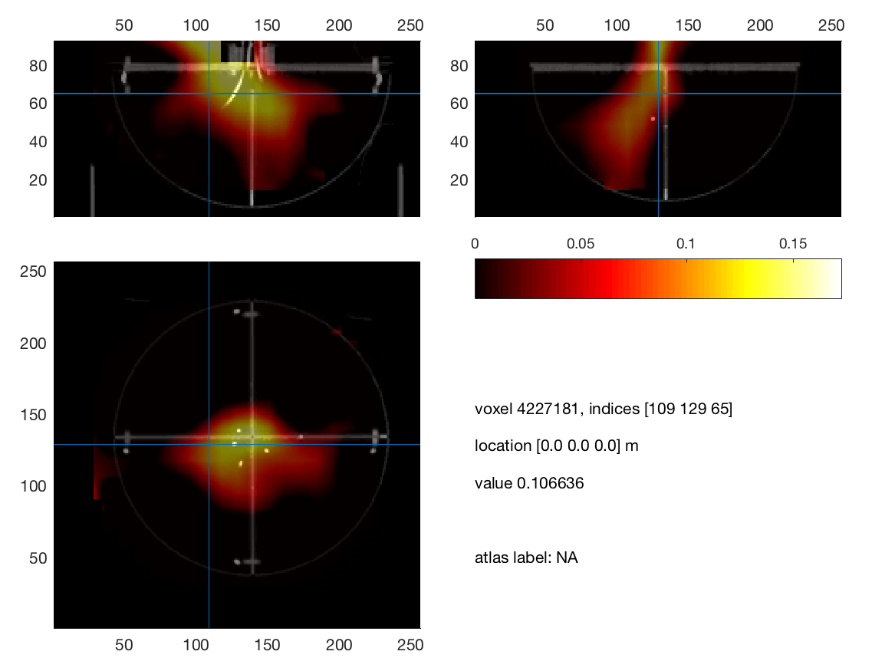
### LCMV scan, log10(active/baseline)
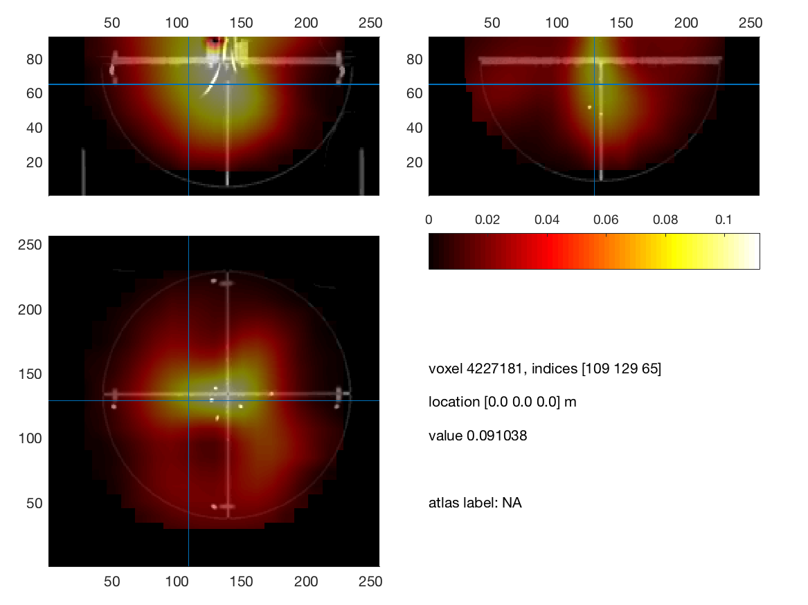
